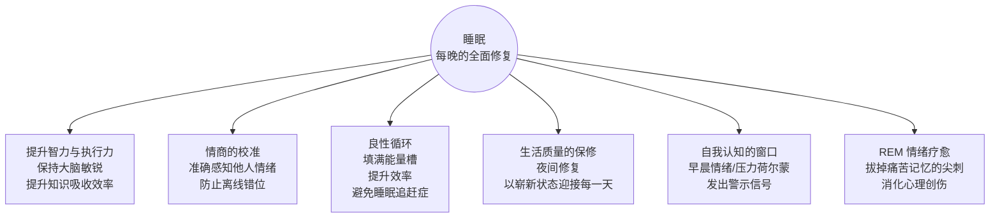
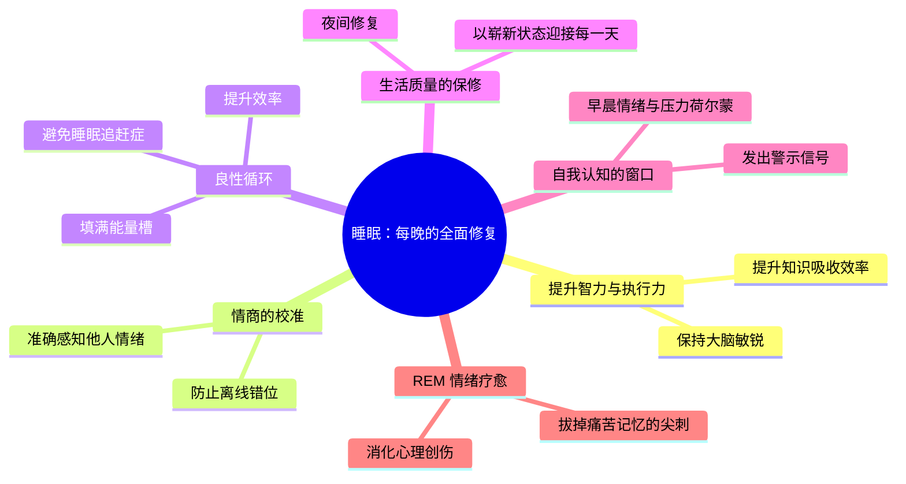
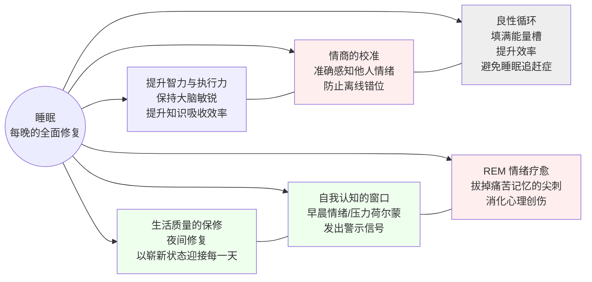

```
<svg width="100%" viewBox="0 0 680 620" role="img" xmlns="http://www.w3.org/2000/svg">
  <title>睡眠的重要性</title>
  <desc>睡眠在智力、情绪、情商、自我认知和生活质量五个维度的作用概览</desc>
  <defs>
    <marker id="arrow" viewBox="0 0 10 10" refX="8" refY="5" markerWidth="6" markerHeight="6" orient="auto-start-reverse">
      <path d="M2 1L8 5L2 9" fill="none" stroke="context-stroke" stroke-width="1.5" stroke-linecap="round" stroke-linejoin="round"/>
    </marker>
    <style>
      text { font-family: sans-serif; fill: #1a1a1a; }
      .th { font-size: 14px; font-weight: 500; }
      .ts { font-size: 12px; font-weight: 400; fill: #555; }
      .c-purple rect { fill: #EEEDFE; stroke: #534AB7; }
      .c-purple text { fill: #3C3489; }
      .c-blue rect { fill: #E6F1FB; stroke: #185FA5; }
      .c-blue text { fill: #0C447C; }
      .c-teal rect { fill: #E1F5EE; stroke: #0F6E56; }
      .c-teal text { fill: #085041; }
      .c-coral rect { fill: #FAECE7; stroke: #993C1D; }
      .c-coral text { fill: #712B13; }
      .c-amber rect { fill: #FAEEDA; stroke: #854F0B; }
      .c-amber text { fill: #633806; }
      .c-green rect { fill: #EAF3DE; stroke: #3B6D11; }
      .c-green text { fill: #27500A; }
      .c-gray rect { fill: #F1EFE8; stroke: #5F5E5A; }
      .c-gray text { fill: #444441; }
      .arr { stroke: #888; fill: none; stroke-width: 1; }
    </style>
  </defs>

  <!-- Central node: Sleep -->
  <g class="c-purple">
    <rect x="265" y="258" width="150" height="54" rx="27" stroke-width="1"/>
    <text class="th" x="340" y="282" text-anchor="middle" dominant-baseline="central" font-size="15">睡眠</text>
    <text class="ts" x="340" y="300" text-anchor="middle" dominant-baseline="central">每晚的全面修复</text>
  </g>

  <!-- Top: 智力与执行力 -->
  <line x1="340" y1="258" x2="340" y2="188" class="arr" marker-end="url(#arrow)"/>
  <g class="c-blue">
    <rect x="232" y="120" width="216" height="64" rx="8" stroke-width="0.5"/>
    <text class="th" x="340" y="146" text-anchor="middle" dominant-baseline="central">提升智力与执行力</text>
    <text class="ts" x="340" y="168" text-anchor="middle" dominant-baseline="central">保持大脑敏锐，提升知识吸收效率</text>
  </g>

  <!-- Bottom: 生活质量保修 -->
  <line x1="340" y1="312" x2="340" y2="390" class="arr" marker-end="url(#arrow)"/>
  <g class="c-teal">
    <rect x="232" y="392" width="216" height="64" rx="8" stroke-width="0.5"/>
    <text class="th" x="340" y="418" text-anchor="middle" dominant-baseline="central">生活质量的保修</text>
    <text class="ts" x="340" y="440" text-anchor="middle" dominant-baseline="central">夜间修复，以崭新状态迎接每一天</text>
  </g>

  <!-- Left: REM情绪疗愈 -->
  <line x1="265" y1="278" x2="185" y2="248" class="arr" marker-end="url(#arrow)"/>
  <g class="c-coral">
    <rect x="20" y="180" width="196" height="76" rx="8" stroke-width="0.5"/>
    <text class="th" x="118" y="210" text-anchor="middle" dominant-baseline="central">REM 情绪疗愈</text>
    <text class="ts" x="118" y="234" text-anchor="middle" dominant-baseline="central">拔掉痛苦记忆的"尖刺"</text>
    <text class="ts" x="118" y="252" text-anchor="middle" dominant-baseline="central">消化心理创伤</text>
  </g>

  <!-- Right: 情商校准 -->
  <line x1="415" y1="278" x2="470" y2="248" class="arr" marker-end="url(#arrow)"/>
  <g class="c-amber">
    <rect x="468" y="180" width="196" height="76" rx="8" stroke-width="0.5"/>
    <text class="th" x="566" y="210" text-anchor="middle" dominant-baseline="central">情商的校准</text>
    <text class="ts" x="566" y="234" text-anchor="middle" dominant-baseline="central">准确感知他人情绪</text>
    <text class="ts" x="566" y="252" text-anchor="middle" dominant-baseline="central">防止"齿轮错位"</text>
  </g>

  <!-- Left bottom: 自我认知 -->
  <line x1="265" y1="300" x2="185" y2="340" class="arr" marker-end="url(#arrow)"/>
  <g class="c-green">
    <rect x="20" y="320" width="196" height="76" rx="8" stroke-width="0.5"/>
    <text class="th" x="118" y="350" text-anchor="middle" dominant-baseline="central">自我认知的窗口</text>
    <text class="ts" x="118" y="374" text-anchor="middle" dominant-baseline="central">早晨情绪 = 压力晴雨表</text>
    <text class="ts" x="118" y="390" text-anchor="middle" dominant-baseline="central">超限时发出警示信号</text>
  </g>

  <!-- Right bottom: 良性循环 -->
  <line x1="415" y1="300" x2="470" y2="340" class="arr" marker-end="url(#arrow)"/>
  <g class="c-gray">
    <rect x="468" y="320" width="196" height="76" rx="8" stroke-width="0.5"/>
    <text class="th" x="566" y="350" text-anchor="middle" dominant-baseline="central">良性循环</text>
    <text class="ts" x="566" y="374" text-anchor="middle" dominant-baseline="central">填满奖赏桶，提升效率</text>
    <text class="ts" x="566" y="390" text-anchor="middle" dominant-baseline="central">避免晚睡强迫症</text>
  </g>

  <!-- Footer hint -->
  <text class="ts" x="340" y="510" text-anchor="middle" opacity="0.45">睡眠的五大核心作用</text>
</svg>
```