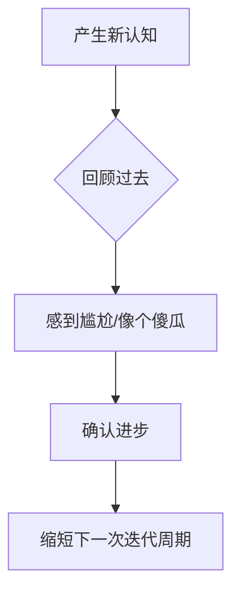

## “傻瓜指数”（Fool Index）：一种衡量认知迭代的动态指标

“傻瓜指数”并非贬义，而是一个关于**自我修正频率**的量化工具。它衡量的是：从你采取行动到你意识到该行动“极其愚蠢”之间的时间差。

---

### 1. 核心逻辑：时间跨度与成长率

该指数通过回溯视角，将**进步速度**转化为**时间距离**。

|**傻瓜指数（时间跨度）**|**成长速度**|**认知状态描述**|
|---|---|---|
|**极短**（如：一个月）|**极快**|处于高频迭代期，能迅速识别并纠正认知偏差。|
|**中等**（如：一年）|**稳健**|保持常规学习，心智模型随着阅历增长而更新。|
|**极长**（如：十年）|**缓慢**|认知高度固化，新的信息难以撼动旧的思维定势。|
|**零/不存在**|**停滞**|陷入“全知全能”的错觉，拒绝承认过往的局限性。|

---

### 2. 深度内涵：承认错误的成本

- **落差即进步：** 如果你回首往事不觉得尴尬，说明你这段时间没有获得实质性的成长。这种“尴尬感”本质上是新旧认知之间的**落差**。
    
- **反脆弱性：** 能够频繁感到自己“以前像个傻瓜”，意味着你拥有极强的反思能力和极低的自尊包袱（Ego）。
    
- **摩根·豪泽尔的视角：** 优秀的思想者（如 Morgan Housel）不追求永远正确，而追求**更早地发现错误**。他认为心智模型必须是动态的，以适应不断变化的世界规则。
    

---

### 3. 实践意义：将“羞耻”转化为“勋章”

- **对抗固执：** 强制自己定期自省，主动寻找过去决策中的漏洞。
    
- **降低认知门槛：** 意识到“现在的我也可能在未来看起来像个傻瓜”，会让你在决策时更加审慎且保持开放。
    
- **衡量标准：** 你的“傻瓜指数”越短，你脱离舒适区、接触新知识的频率就越高。

---
