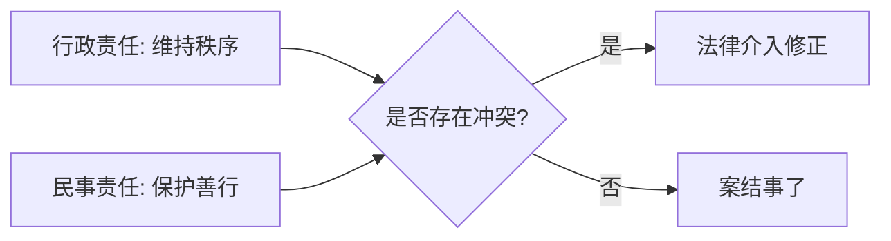

graph TD
    A[发生事故: 老人自行摔倒] --> B{交警介入}
    B -- 行政逻辑: 维持秩序 --> C[判定女生次责]
    C --> C1[理由: 未满16岁/转弯未让行/空间压迫]
    
    A --> D{法院/社会介入}
    D -- 民事逻辑: 公平道德 --> E[适用好人条款]
    E --> E1[结果: 保护善意施救/免除赔偿责任]

    C1 -. 冲突点: 索赔依据 .-> F[原告索赔 22 万]
    E1 -. 修正点: 结果正义 .-> G[原告撤诉/法院驳回]


在 Obsidian 中，显示流程图最标准的方式是使用 **Mermaid** 语法。你只需要将代码包裹在以 `mermaid` 为标识符的代码块中即可。

### 1. 如何在 Obsidian 中输入

在你的笔记中输入以下格式（注意将 ` ``` ` 换成英文格式）：

代码段

```
graph LR
    A[行政责任: 维持秩序] --> C{是否存在冲突?}
    B[民事责任: 保护善行] --> C
    C -->|是| D[法律介入修正]
    C -->|否| E[案结事了]
```

### 2. Mermaid 基础语法指南

为了方便你自定义流程图，这里整理了几个常用的语法标签：

|**语法**|**功能说明**|**示例**|
|---|---|---|
|`graph TD`|**T**op to **D**own，自上而下的流程图|`graph TD`|
|`graph LR`|**L**eft to **R**ight，自左向右的流程图|`graph LR`|
|`[ ]`|**矩形节点**，表示过程或事实|`[女生扶人]`|
|`{ }`|**菱形节点**，表示判断或决策|`{是否违规?}`|
|`(( ))`|**圆形节点**，表示开始或结束|`((开始))`|
|`-->`|**带箭头的实线**，表示流程指向|`A --> B`|
|`-.->`|**带箭头的虚线**，表示间接关联|`A -.-> B`|

---

### 3. 针对本案的 Obsidian 进阶技巧

既然你关注“法律逻辑冲突”，建议在 Obsidian 中使用 **Callout (注释框)** 配合流程图使用，效果会非常清晰：

> [!ABSTRACT] 法律定责逻辑图
> 
> 代码段
> 
> ```
> graph TD
>     违法行为[15岁骑车/转弯未让行] -->|触犯| 交通法[道路交通安全法]
>     交通法 -->|结果| 次要责任认定[行政定责: 维持秩序]
>     
>     救助行为[主动扶人/移开车辆] -->|符合| 民法典[民法典第184条]
>     民法典 -->|结果| 豁免民事赔偿[民事定责: 保护善行]
>     
>     次要责任认定 -.->|被利用为| 索赔依据[原告索赔 22 万]
>     豁免民事赔偿 -->|最终修正| 撤诉/无责[正义达成]
> ```

### 4. 预览与编辑

- **编辑模式**：你会看到原始代码。
    
- **阅读模式/实时预览**：Obsidian 会自动将其渲染为美观的矢量图形。
    
- **导出**：当你将笔记导出为 PDF 或图片时，这些图表也会被完整保留。
    

你需要我针对这一逻辑，为你写一个可以直接复制到 Obsidian 里的完整“案件复盘模板”吗？

在 Obsidian 中，显示流程图最标准的方式是使用 **Mermaid** 语法。你只需要将代码包裹在以 `mermaid` 为标识符的代码块中即可。

### 1. 如何在 Obsidian 中输入

在你的笔记中输入以下格式（注意将 ````` 换成英文格式）：



### 2. Mermaid 基础语法指南

为了方便你自定义流程图，这里整理了几个常用的语法标签：

| 语法 | 功能说明 | 示例 |
| --- | --- | --- |
| `graph TD` | **T**op to **D**own，自上而下的流程图 | `graph TD` |
| `graph LR` | **L**eft to **R**ight，自左向右的流程图 | `graph LR` |
| `[ ]` | **矩形节点**，表示过程或事实 | `[女生扶人]` |
| `{ }` | **菱形节点**，表示判断或决策 | `{是否违规?}` |
| `(( ))` | **圆形节点**，表示开始或结束 | `((开始))` |
| `-->` | **带箭头的实线**，表示流程指向 | `A --> B` |
| `-.->` | **带箭头的虚线**，表示间接关联 | `A -.-> B` |

---

### 3. 针对本案的 Obsidian 进阶技巧

既然你关注“法律逻辑冲突”，建议在 Obsidian 中使用 **Callout (注释框)** 配合流程图使用，效果会非常清晰：

> [!ABSTRACT] 法律定责逻辑图
> ```mermaid
> graph TD
>     违法行为[15岁骑车/转弯未让行] -->|触犯| 交通法[道路交通安全法]
>     交通法 -->|结果| 次要责任认定[行政定责: 维持秩序]
>     
>     救助行为[主动扶人/移开车辆] -->|符合| 民法典[民法典第184条]
>     民法典 -->|结果| 豁免民事赔偿[民事定责: 保护善行]
>     
>     次要责任认定 -.->|被利用为| 索赔依据[原告索赔 22 万]
>     豁免民事赔偿 -->|最终修正| 撤诉/无责[正义达成]
> 
> ```
> 
> 

### 4. 预览与编辑

* **编辑模式**：你会看到原始代码。
* **阅读模式/实时预览**：Obsidian 会自动将其渲染为美观的矢量图形。
* **导出**：当你将笔记导出为 PDF 或图片时，这些图表也会被完整保留。

你需要我针对这一逻辑，为你写一个可以直接复制到 Obsidian 里的完整“案件复盘模板”吗？