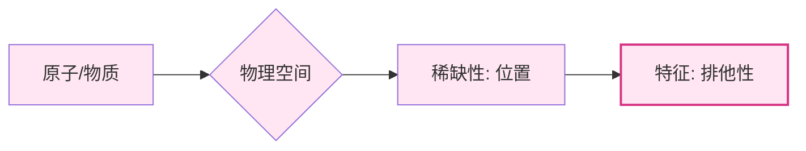
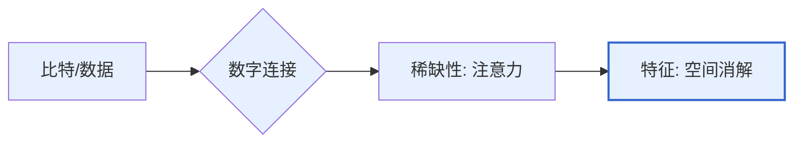
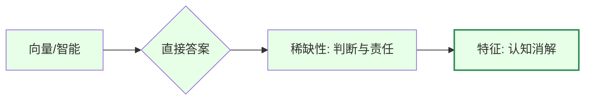
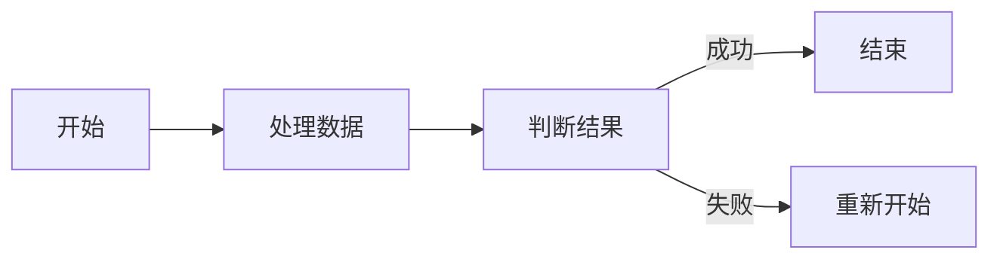
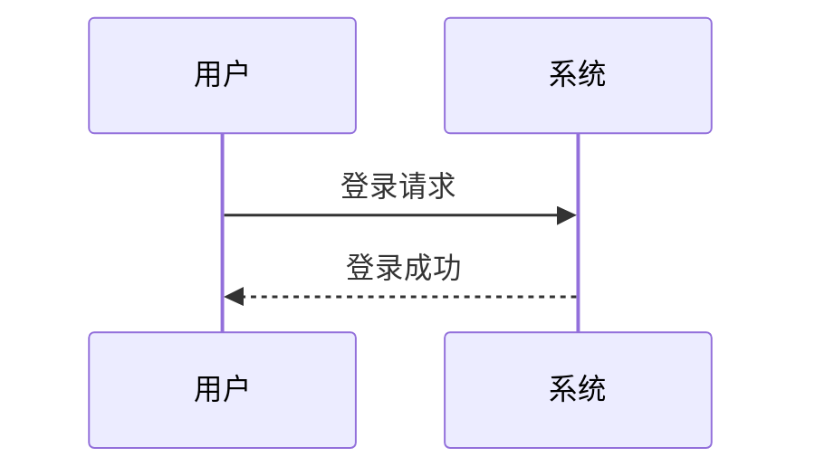
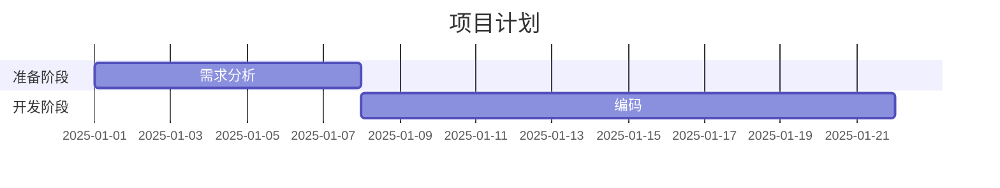

```mermaid
flowchart LR

    %% ========== 原子世界（横向） ==========
    A1[原子/物质] --> A2{物理空间}
    A2 --> A3[稀缺性: 位置]
    A3 --> A4[特征: 排他性]
    %% ========== 颜色样式 ==========
    style A1 fill:#ffe6f2
    style A2 fill:#ffe6f2
    style A3 fill:#ffe6f2
    style A4 fill:#ffe6f2,stroke:#d63384,stroke-width:2px
    classDef clear fill:none,stroke:none
```

```mermaid
flowchart LR

    %% ========== 比特世界（横向） ==========
    B1[比特/数据] --> B2{数字连接}
    B2 --> B3[稀缺性: 注意力]
    B3 --> B4[特征: 空间消解]

    %% ========== 颜色样式 ==========
    style B1 fill:#e6f0ff
    style B2 fill:#e6f0ff
    style B3 fill:#e6f0ff
    style B4 fill:#e6f0ff,stroke:#3366cc,stroke-width:2px
    classDef clear fill:none,stroke:none
```

```mermaid
flowchart LR

    %% ========== 向量世界（横向） ==========
    C1[向量/智能] --> C2{直接答案}
    C2 --> C3[稀缺性: 判断与责任]
    C3 --> C4[特征: 认知消解]
    style C1 fill:#e6ffe6
    style C2 fill:#e6ffe6
    style C3 fill:#e6ffe6
    style C4 fill:#e6ffe6,stroke:#2e8b57,stroke-width:2px

    classDef clear fill:none,stroke:none
```

```mermaid
flowchart LR
    开始 --> 处理数据 --> 判断结果
    判断结果 -->|成功| 结束
    判断结果 -->|失败| 重新开始
```
sequenceDiagram
    participant 用户
    participant 系统
    用户->>系统: 登录请求
    系统-->>用户: 登录成功

```mermaid
sequenceDiagram
    participant 用户
    participant 系统
    用户->>系统: 登录请求
    系统-->>用户: 登录成功
```
title 项目计划
    section 准备阶段
    需求分析 :a1, -01-01, 7d
    section 开发阶段
    编码 :after a1, 14d

```mermaid
gantt
    title 项目计划
    section 准备阶段
    需求分析 :a1, 2025-01-01, 7d
    section 开发阶段
    编码 :after a1, 14d
```