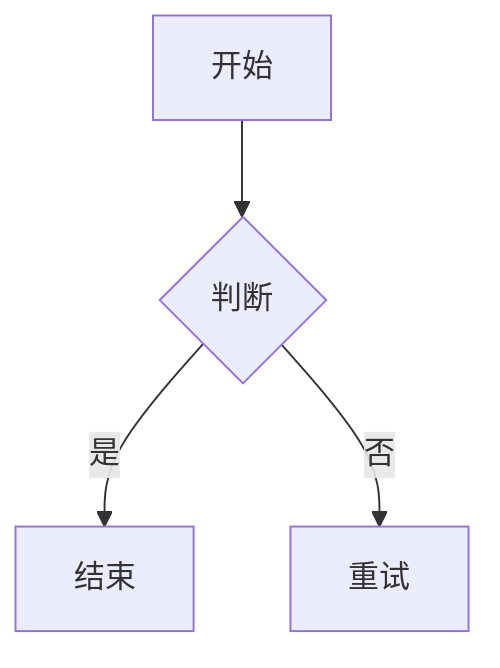

最标准、最快的方式（推荐日常使用）在任意位置输入三个反引号 
键盘上 `Esc 下面那个键，按三次）`，然后回车：

```python
git status

```

在 Obsidian 中添加代码块非常简单，它完全遵循 **Markdown** 的标准语法。

---

### 1. 行内代码 (Inline Code)

如果你只想在一段文字中间突出显示一小段代码或命令，使用**单个反引号**   ( \` )包裹内容。

- **输入：** \`git status\`
    
- **效果：** `git status`

---

### 2. 块级代码 (Code Blocks)

如果你要插入多行代码，需要使用**三个反引号**（\`\`\`） 独占一行作为开头和结尾。

#### 基础语法：

```shell

这里写你的代码

第二行代码

```

#### 带有语法高亮：

在开头的三引号后面直接加上语言名称（如 `python`, `js`, `sql`, `cpp` 等），Obsidian 会自动进行着色。

**输入示例：**

```python

def hello_world():

print("Hello, Obsidian!")

```

**实际效果：**

Python

```python
def hello_world():
    print("Hello, Obsidian!")
```

---

### 3. Obsidian 特色：Mermaid 图表

Obsidian 内置支持 Mermaid，你可以用代码块的形式直接画流程图、甘特图等。

**输入示例：**



---

### 💡 进阶技巧与避坑指南

* **快捷键：** 默认情况下 Obsidian 没有直接的代码块快捷键，但你可以在 `设置 -> 快捷键` 中搜索 **"切换代码块" (Toggle code block)** 并自定义一个（例如 `Ctrl + Shift + C`）。
* **复制按钮：** 在 Obsidian 的“阅读模式”下，将鼠标悬停在代码块右上角，会出现一个一键复制的图标，非常方便。
* **注意输入法：** 必须使用**英文半角**的反引号。如果你在中文输入法下打出的是 `·`（间隔号），代码块是无法生效的。
* **嵌套问题：** 如果你想在代码块里展示“代码块语法”（即显示三个反引号），外层请使用四个反引号包裹。
