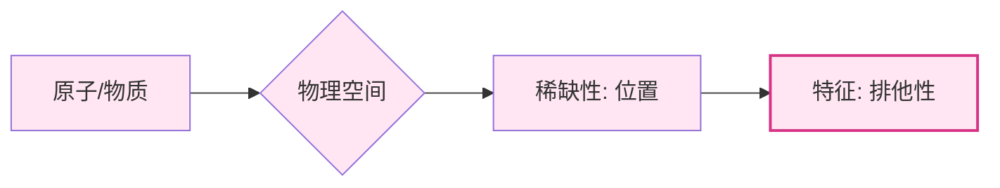
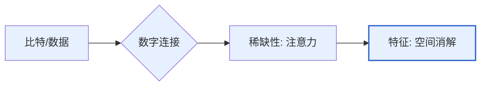
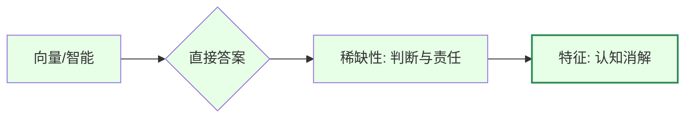

在“AI时代教育变革”的宏大背景下，通过讲者李继刚的视角，提出了一个用于理解生产力演进与社会变迁的 **“三个世界模型”** ,,。这个模型不仅勾勒了**人类文明发展的不同阶段**，更揭示了教育变革之所以在今天成为“必然”的深层逻辑。

---

## 为什么提出“三个世界模型”？

### 1. 核心原因：生产力介质的根本性位移

模型提出的逻辑起点在于：人类处理“生存与发展”的**基础介质**发生了从实物到数据，再到智能的二次跳跃。

- **技术奇点临近：** 当 AI 开始消解人类“理解、消化、综合”的体力与脑力成本时，旧有的基于“比特世界”的信息堆砌教育模式失效了。
    
- **稀缺资源的转移：** 社会财富的分配逻辑正在从“占据空间（原子）”和“夺取眼球（比特）”，转向“提供决策与承担后果（向量）”。

### 2. 核心目的：重构教育与社会变迁的解释框架

李继刚提出此模型，旨在达成以下三个维度的目标：

- **揭示教育变革的“必然性”：**
    
    - 证明当前的教育危机不是局部调整的问题，而是**时代错配**。
        
    - 如果教育还在培养“搜索信息（比特能力）”的人才，那么在“直接给答案（向量时代）”的面前，这些人才将失去竞争力。
        
- **定义人的“增量价值”：**
    
    - 明确在 AI 时代，人的核心竞争力不再是“知晓”，而是 **“判断”与“责任”** 。
        
    - 目的在于引导教育从“知识传递”转向“人格与价值观的塑造”。
        
- **提供演进的坐标轴：**
    
    - 通过将“原子、比特、向量”三者并置，帮助个体和决策者理解当前所处的历史方位，从而在宏大背景下找到转型的切入点。
        

---

### 💡 逻辑一针见血

>**教育变革之所以是“必然”，是因为我们正在从“寻找答案的时代”进入“质问答案的时代”。** 

以往的教育是教你如何高效地从比特世界提取信息，而未来的教育必须教会你如何在向量世界给出的无数答案中，敢于拍板说：“这个方案可行，后果我来担。”

---

## “三个世界模型”的详细讨论：

### 1. 三个世界的定义与演进

- **原子世界 (Atom World)**：这是我们日常行走的物理空间，由原子构成,,。
    - **核心特性**：具有排他性，一个原子占据了位置，另一个就进不来,,。
    - **稀缺性**：**位置 (Location)** 是这个世界的关键稀缺资源,,。

- **比特世界 (Bit World)**：即过去30年由互联网构成的数字世界，传输的是0和1,,。
    - **核心特性**：空间被消解，任意两点之间的距离为零，信息以光速传播,,。
    - **稀缺性**：由于信息过载，**注意力 (Attention)** 成了最值钱的稀缺资源,,。

- **向量世界/AI世界 (Vector World)**：这是当前正在抬头的、由AI驱动的新世界,,。
    - **核心特性**：**直接给答案**。它消解了人类获取信息后进行理解、消化和综合的时间成本，实现了“问题进，答案出”,,。
    - **稀缺性**：当AI可以瞬间提供无数答案时，**判断 (Judgment)** 变得极其稀缺；而判断带来的二阶稀缺性则是**责任 (Responsibility)**，即俗称的“背锅”,,。

| **维度**     | **原子世界 (Atom World)** | **比特世界 (Bit World)**    | **向量/AI 世界  (Vector World)**      |
| ---------- | ------------------------ | -------------------------- | ------------------------------------ |
| **构成基础**   | 物理实体（原子）                 | 数字信息（0 和 1）                | 向量/AI 模型驱动                           |
| **核心特性**   | **排他性**：物体占据物理空间，具有不可重叠性 | **空间消解**：信息以光速传播，点对点距离趋近于零 | **直接交付**：消解理解与综合成本，实现“问题进，答案出”       |
| **核心稀缺资源** | **位置 (Location)**        | **注意力 (Attention)**        | **判断 (Judgment)**                    |
| **二阶稀缺性**  | 资源所有权                    | 影响力/流量                     | **责任 (Responsibility)**：即决策的承担（“背锅”） |
### 2. 为什么互联网（比特世界）没能改变教育？

来源指出，互联网曾给教育圈带来 **“资源平权”** 的虚假希望，认为偏远地区孩子也能看名校课程就能实现教育公平,,。然而，互联网并未触动经济、政治、文化这三套社会评价体系，甚至由于信息传播的加速，反而**加剧了认知的同质化**,,,。因此，李继刚将其称为“虚假的一次机会”,,。

### 3. AI（向量世界）如何强力驱动教育变革？

在向量世界中，AI不再仅仅是工具，而是全人类智慧的集合，能够脱离人类大脑独立进行深度思考,,,。这从根本上动摇了传统教育的根基：

- **知识价值的贬值**：如果教育还在训练孩子做一个装满知识的“水桶”，那么在AI这片“知识之海”面前，这种努力将变得毫无意义且昂贵,,,。
- **从“工具性”向“主体性”转型**：工业时代（原子世界逻辑）关注人如何作为工具被使用，追求同质化,,。AI时代则要求人回归**主体性**，即发掘每个人的**异质性**,,。
- **能力的重定义**：由于AI能提供80分的标准化分值，人类未来交付的价值必须在于那些“捅破AI天花板”的独特维度，即基于个人审美、经验和特质做出的**关键决策与判断**,,。

### 4. 结论：从“应然”走向“实然”

来源认为，过去的教育改革多是理念上的推演（应然），而向量世界的到来是生产力的真实跃迁（实然）,,,。当社会生产关系因AI向“一人公司”模式转型时，社会评价体系将不再看重学历，而是看重结果交付能力,,。这种**结构性的拉动**将迫使教育体系从“水的教育”（注满一桶水）彻底转向“火的教育”（点燃孩子天命之火）,,,。

---

