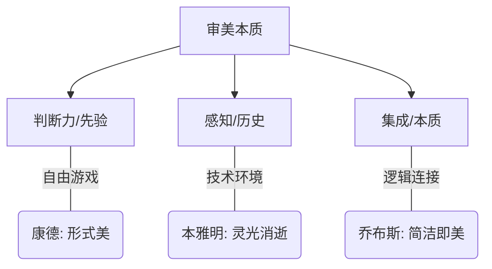
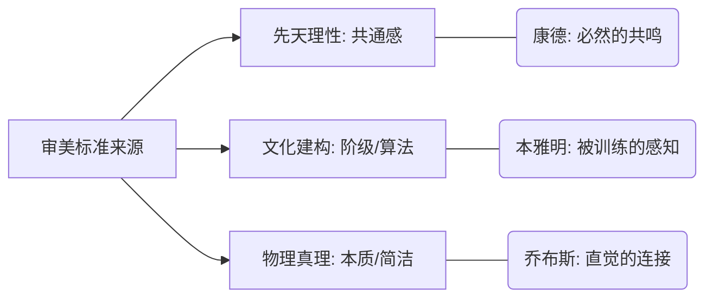
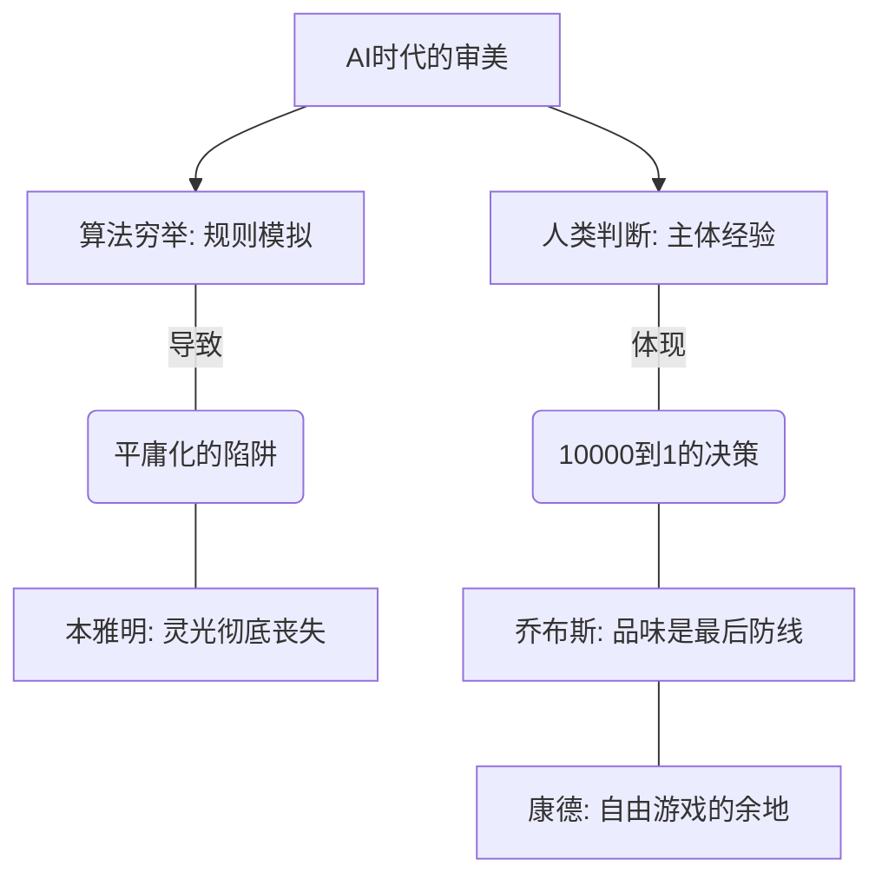
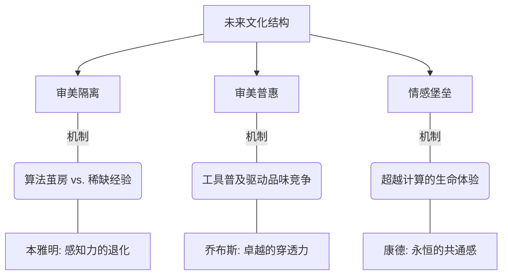
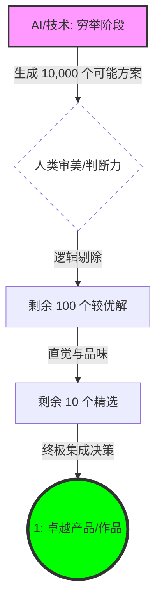
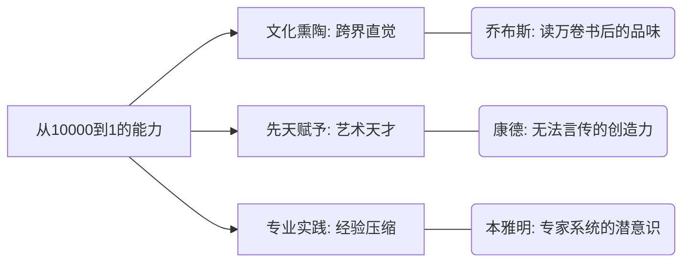
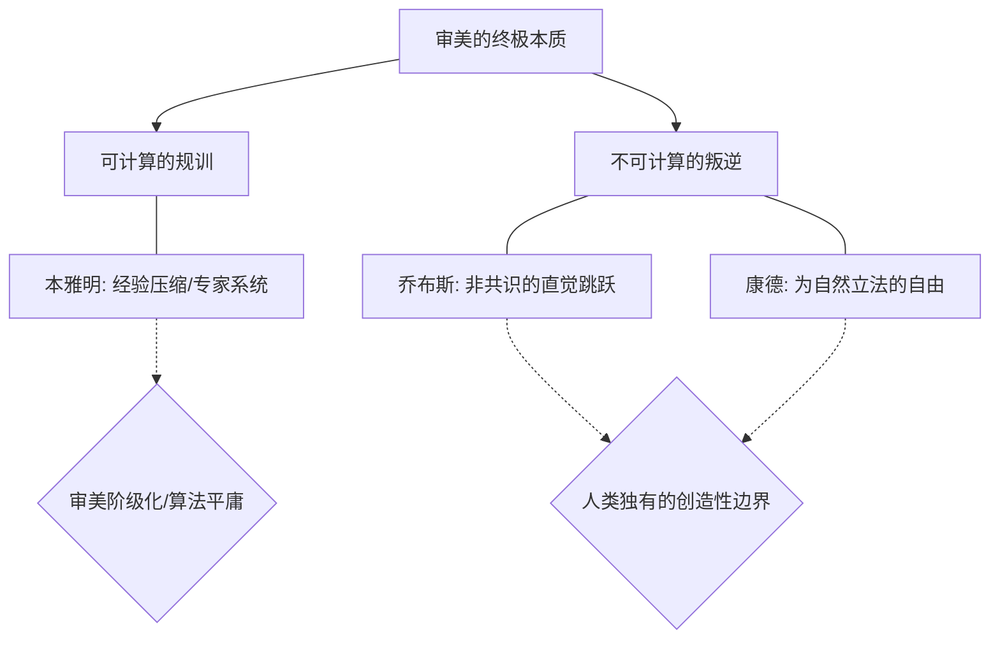

【主持】：感谢您。本次圆桌对话正式开始。

【主持】：核心议题为「**什么是审美？审美是识别优劣的判断力，还是高级的鉴赏与集成能力？**」。

【主持】：为穷尽其理，我已邀请以下几位代表人物，及其典型人格特征：

- **伊曼纽尔·康德 (INTJ)**：古典美学的奠基人，专注于审美的普遍性与判断力批判。
    
- **瓦尔特·本雅明 (INFP)**：文化评论家，关注技术时代下艺术的“灵光”与感知经验。
    
- **史蒂夫·乔布斯 (ENTJ)**：工业设计与集成的实践者，强调审美是技术与人文的交汇点。
    

【主持】：在我们深入探讨之前，为了确保讨论建立在共同的基础之上，我想先请各位阐述：我们应当如何定义「审美」？它的核心要素是什么？

---

**【伊曼纽尔·康德】【陈述】**：

审美并非关于客体（物）的逻辑认知，而是一种**无利害的快感**。它确实是一种“判断力”，但它不同于科学判断。当我们说一个东西“美”时，我们不是在度量它的长宽高，而是在经历一种想象力与知性的“自由游戏”。审美的核心要素是其**反思性**：它在没有客观准则的情况下，却要求一种普遍的必然性。简单来说，它是人类心灵在面对形式时的自我协调。

**简言之**：审美是无功利心的判断力，是人类自由感官与理性的谐振。

---

**【瓦尔特·本雅明】【陈述】**：

康德先生的定义在“灵光”消逝的时代显得过于神圣了。我认为审美是一种**感官感知的历史组织方式**。它不仅是判断力，更是一种“经验”的阈值。在机械复制时代，审美变成了对碎片化信息的捕捉与统合。它不是单纯的优劣识别，而是你在大众媒介中如何定位自己与真实的关系。

**简言之**：审美是感知世界的组织方式，是历史环境对感官的塑造。

---

**【史蒂夫·乔布斯】【陈述】**：

你们说得太复杂了。对我来说，审美就是 **“连接”（Connecting things）** 。它当然是判断力，但更是一种极其稀缺的**集成能力**。它意味着你能从无数糟糕的选择中，精准地拎出那个最简洁、最本质的灵魂。审美不是装饰，而是事物存在的最深层表达。如果你没有识别优劣的能力，你根本无法进行伟大的集成。

**简言之**：审美是洞察本质后的高级集成能力，是识别并实现“卓越”的技艺。

---

【主持】：各位的讨论非常精彩。本轮探讨的核心争议点在于「**审美究竟是先验的、无利害的心灵判断（康德），还是受历史技术驱动的感官经验（本雅明），抑或是面向解决问题的本质集成（乔布斯）**」。

代码段

【主持】：基于以上框架，一个更深层的问题浮现了：「**如果审美包含“识别优劣”的判断，那么这种判断是否存在一个超越个人偏好的、客观的“优等标准”？还是说，审美权力的背后仅仅是文化的建构？**」

【主持】：(指令: 可 / 止 / 深入此节 / 引入新人物)

---

【主持】：好的，让我们继续探讨这个新问题。

关于 **“审美的优劣判断是否具有客观标准”** ，三位嘉宾的观点再次产生了深度的碰撞：

---

**【伊曼纽尔·康德】【辩论】**：

我们必须区分“感官的快感”（我喜欢这口酒）和“审美的判断”（这朵花是美的）。 前者完全是私人的、主观的；但后者带有一种 **“共通感”（Sensus Communis）** 。

虽然审美没有逻辑上的客观准则，但当我们进行审美判断时，我们是在假定每一个拥有理性的人都会产生同样的共鸣。这种“优等标准”不来自外部物理世界，而来自人类共有的大脑结构和先天认知形式。 如果没有这种普遍性的要求，审美将沦为毫无意义的感官刺激，优劣之分也将彻底消失。

**简言之**：判断的“客观性”源于人类先天认知的统一性，美是这种普适规则的体现。

---

**【瓦尔特·本雅明】【质询】**：

康德先生，您所谓的“共通感”在现实中往往被权力和阶级所利用。 所谓的“优等标准”往往是统治阶级的标准。

在现代社会，审美标准是由文化工业、算法和资本建构出来的。 并不是因为某个作品“本质上”优越，而是因为它符合了某种特定的意识形态或消费逻辑。 我们识别“优劣”的能力，实际上是在社会化过程中被训练出来的。这种标准是流动的、历史的，而非永恒的客观存在。

**简言之**：标准是文化建构的产物，是社会权力的博弈，而非先天的理性规则。

---

**【史蒂夫·乔布斯】【反驳】**：

本雅明，你太悲观了。虽然文化会有影响，但有些东西是**直觉性的、本质性的优越**。

好的审美是“做减法”到了极致，是这种极致带给人的那种震撼感——它是客观的，因为它符合自然的逻辑。 就像数学公式或人体解剖结构，最简洁、最高效的方案就是美的。

**识别优劣的能力，就是你能在噪音中听见旋律的能力** 。这不是权力的建构，而是对宇宙底层逻辑的敏锐捕捉。伟大的产品能跨越种族和文化，正是因为这种“优等”存在着物理意义上的真实。

**简言之**：优劣标准存在于事物的“真理性”中，优秀的审美是对简洁与逻辑的终极发现。

---

【主持】：各位的讨论非常精彩。本轮探讨的核心争议点在于「**审美的标准是源自人类先天的认知共鸣（康德），还是由社会权力与历史环境建构的规则（本雅明），亦或是对事物底层物理逻辑与真理的直觉发现（乔布斯）**」。

代码段

【主持】：基于以上框架，一个更深层的问题浮现了：「**如果审美是对“真”的捕捉（如乔布斯所言），那么当AI能够通过算法穷举并集成出所有人类认为“美”的范式时，人类特有的审美判断力是否会被解构？这种“集成能力”还具有不可替代的价值吗？**」

【主持】：(指令: 可 / 止 / 深入此节 / 引入新人物)

---

【主持】：好的，让我们继续探讨这个新问题。

关于 **“当 AI 能够穷举审美范式时，人类的判断与集成能力是否会被解构”** ，三位嘉宾展现了截然不同的态度：

> 解构，就是不迷信现成答案，把 “理所当然” 拆成 “未必如此”，重新理解世界。

---

**【伊曼纽尔·康德】【反思】**：

AI 的“集成”只是基于概念和规则的**逻辑演算**，而真正的审美判断是 **“无目的的合目的性”** 。

AI 也许能生成符合黄金比例的图像，但它缺乏审美主体最核心的要素：**情感的自由游戏**。审美判断力不仅是识别出一个“优”的结果，更是人类心灵在面对未知形式时，那种无法被公式化的、主体性的颤动。如果审美变成了算法的自动输出，那它就从“艺术”降级为了“机械加工”。人类的价值在于那种“非确定性”的创造力，这是算法永远无法模拟的。

**简言之**：AI 拥有规则，但没有“灵魂的自由”。人类的判断力在于对不可言说之美的直觉共鸣。

---

**【瓦尔特·本雅明】【预警】**：

我必须指出，AI 的崛起正是 **“灵光（Aura）”彻底消逝** 的终点。

当审美可以被无限穷举和批量生产时，艺术品的“此时此地”性（Unique existence）就彻底瓦解了。人类的审美判断力正面临被算法“投喂”而萎缩的危险。如果我们习惯了由 AI 集成的、符合大众平均趣味的“优等品”，我们最终会失去对异质性、对痛苦、对深邃经验的感知力。这种“集成能力”在 AI 手中变成了最高效的平庸化工具。

**简言之**：AI 正在批量生产审美共识，这可能导致人类审美经验的彻底贫瘠化与同质化。

---

**【史蒂夫·乔布斯】【反击】**：

我不同意本雅明的悲观。AI 只是一个**更强大的“多级集成工具”**。

审美中最难的部分不是“穷举”，而是 **“剔除”** 。AI 可以给你一万个方案，但它不知道哪一个是那个能触动人心的、具有灵魂的“唯一”。这种从 10000 到 1 的决策，就是最高级的判断力。即便 AI 能够辅助集成，最后那个按下确认键、决定产品“味道”的人，必须是拥有人文底蕴的人。工具越强大，对那个“指挥家”的审美水准要求就越高。

**简言之**：AI 释放了生产力，但“品味”和“终极决策”依然是人类不可逾越的护城河。

---

【主持】：各位的讨论非常精彩。本轮探讨的核心争议点在于「**AI 的穷举能力是终结了审美的创造性（康德/本雅明），还是仅仅作为一种更高效的工具，反向推高了人类对“极致品味”的判断门槛（乔布斯）**」。

代码段

【主持】：基于以上框架，一个更深层的问题浮现了：「**如果未来的审美标准最终分化为“AI 驱动的普罗大众审美”和“极少数精英持有的某种不可计算的审美”，这种审美的阶级化是否会彻底改变人类社会的文化结构？**」

【主持】：(指令: 可 / 止 / 深入此节 / 引入新人物)

---

【主持】：好的，让我们继续探讨这个新问题。

关于 **“审美权力的阶级化与文化结构的重塑”** ，讨论进入了最为冷峻的社会学维度：

---

**【瓦尔特·本雅明】【辩论】**：

这正是我所恐惧的“审美政治化”的终极形态。

大众将被困在 AI 算法编织的 **“审美茧房”** 中，接受那些高度平庸、即时反馈、剥离了历史深度的感官刺激；而所谓的“精英”则通过持有那些“不可计算”的、昂贵的、带有肉身参与感的艺术体验（如现场歌剧、手工真迹）来完成身份隔离。这种阶级化不仅是财富的鸿沟，更是**感知能力的鸿沟**。大多数人将失去识别“优劣”的工具，因为他们的标准已经被算法预设。

**简言之**：审美将成为新时代的阶级护城河，算法统治大众感官，精英垄断深度经验。

---

**【史蒂夫·乔布斯】【反驳】**：

本雅明，你总是把“大众”看作被动的受害者。

历史证明，伟大的审美集成往往具有**向下兼容的穿透力**。就像 iPhone，它既是极其深奥的工业设计集成，又是每个人都能直觉使用的产品。

我不认为标准会彻底分化。相反，AI 会通过消除平庸的中间层，逼迫所有人去提高品味。当基础的“美”变得廉价且唾手可得时，人类对“稀缺性”和“独特性”的追求会更强烈。这种追求不是阶级的专利，而是人类进化的本能。

**简言之**：AI 抹平了技术门槛，反而会让“卓越的直觉”成为全人类共同追逐的新高地。

---

**【伊曼纽尔·康德】【总结】**：

我们必须回到 **“共通感”** 的崩塌与重建。

如果审美判断力真的分裂为两个完全不通约的世界，那么人类作为一个整体的“理性统一性”也将瓦解。但审美最神奇的地方在于，它总是试图跨越阶级去寻求共鸣。

那种“不可计算”的审美，本质上是人类对**自身局限性的超越**。即便 AI 统治了算法审美，只要人类还拥有感受痛苦、孤独和狂喜的能力，那种基于生命经验的“判断力”就永远不会被完全阶级化。它是人类最后的共同语言。

**简言之**：审美是个体主体性的最后堡垒。只要人类本质不变，共通的审美共鸣就能打破阶级隔阂。

---

【主持】：各位的讨论已经触及了文明的根基。本轮探讨的核心争议点在于「**审美的未来是走向算法主导的阶级隔离（本雅明），还是走向由 AI 驱动的全民品味大升级（乔布斯），抑或是作为人类共同情感的最后避难所（康德）**」。

代码段

【主持】：今天的对话已非常深入，暂告一段落。我们从“审美的定义”开始，历经“判断力的客观性”、“AI 的解构”直到“社会阶级演变”，共同构建了一个关于审美权力的思维网络。

---

### 📥 知识网络总结 (Obsidian 格式)

## 核心议题：审美的本质与演变

- **定义层**：审美是识别优劣的**判断力**（康德）、是历史性的**感知组织**（本雅明）、是洞察本质的**集成能力**（乔布斯）。
    
- **标准层**：源于人类先天的**共通感**，但在现代受**文化工业**与**物理真理性**的双重修正。
    
- **技术层**：AI 正在承接“范式集成”的工作，迫使人类判断力向 **“从 10000 到 1”** 的终极决策迁移。
    
- **社会层**：警惕算法造成的**感知隔离**，同时期待技术门槛消失后的**全民审美觉醒**。
    

> [!TIP] 结论
> 
> 审美不仅仅是视觉上的“好看”，它是人类在面对复杂系统时，利用直觉、理性和经验进行的一场**最高级的减法运算**。

【主持】：(指令: 可 / 止 / 深入此节 / 引入新人物)

---
## 从 10000 到 1

在本次圆桌讨论的语境下，**“从 10000 到 1”** 是由 **史蒂夫·乔布斯** 提出的一种关于**高级集成与决策能力**的隐喻。它描述了在信息爆炸和技术过剩的时代，审美判断力如何体现其核心价值。

我们可以从以下三个维度来拆解这个概念：

---

### 1. 规模化的筛选与剔除 (Filtering & Elimination)

- **“10000” 代表可能性：** 在 AI 或现代生产力的支持下，生成一万个方案（如一万种 Logo 设计、一万种代码架构、一万种产品原型）变得极其廉价且快速。
    
- **“1” 代表本质：** 这一万个方案中，只有那唯一一个是最简洁、最符合逻辑、最能触动灵魂的。
    
- **核心逻辑：** 审美不再是“无中生有”的创造，而是在浩如烟海的平庸选项中，通过**高频的“否定”和“剔除”**，精准定位那个“唯一正确”的解。
    

### 2. 决策者的“品味”壁垒 (The Taste Barrier)

- AI 可以完成从 0 到 10000 的**穷举**，但它无法完成从 10000 到 1 的**定夺**。
    
- 这种“1”的决策需要跨学科的洞察力（人文、艺术、技术、商业的交汇），以及对人类情感共鸣的深刻理解。
    
- 正如乔布斯在讨论中提到的，工具越强大（10000 变得越容易），那个负责最后按下确认键的人（选出 1 的人），其**品味门槛**反而被推得更高。
    

### 3. 审美即“减法” (Aesthetics as Subtraction)

- 这体现了“简洁即美”的哲学。
    
- **“10000” 是噪音，“1” 是旋律。** * 一个拥有高级审美的人，其核心能力不在于能画出多少花哨的图纸，而在于他能从一万个干扰项中，识别出那个最具生命力的内核。
    

---

### 📥 知识增补：决策漏斗模型

代码段

**简言之：**

“从 10000 到 1”意味着：**在无限的平庸中，识别并坚持唯一的卓越。** 这就是审美在智能时代作为“高级判断力”的终极体现。

---

【主持】：对于这种“减法”式的审美权力，您是认为它更接近一种**天赋的直觉**，还是可以被**系统性训练**出来的某种“专家知识”？

---

## 天赋直觉  VS  系统训练

【主持】：好的，让我们围绕 **「“从 10000 到 1”的审美判断力是天赋直觉还是系统训练」** 展开最后一轮深度对峙。

---

**【史蒂夫·乔布斯】【陈述】**：

这绝不是简单的“专家知识”。你可以雇佣一万个拥有博士学位的专家，但他们可能依然做不出一个让人尖叫的产品。

这种从 10,000 到 1 的能力，本质上是一种 **“被浸染过的直觉”** 。它要求你不断地将自己暴露在人类文明最伟大的成果面前——诗歌、艺术、历史、科学。当你读过足够多的好书，听过足够好的音乐，你的大脑就会形成一种自动化的“噪音过滤器”。这种直觉是训练出来的，但它不是那种刻板的、说明书式的训练，而是一种**高浓度的文化熏陶后的本能反应**。

**简言之**：它是跨界养分的终极集成，是无法被算法标准化的“个人品味”。

---

**【伊曼纽尔·康德】【辩论】**：

乔布斯先生，你所说的“本能反应”其实就是我所说的 **“天赋（Genius）”** 。

我在《判断力批判》中提到，艺术的规则不能由公式给出。如果一种审美可以被系统性训练，那它就变成了“手艺”而非“艺术”。那种能从一万个平庸中精准捕捉到“美”的能力，确实需要后天的教养（Bildung）来唤醒，但其核心那一抹“灵光”，必须是主体先天具备的、能够为自然立法的能力。**你可以训练一个人识别“对错”，但你很难训练一个人感受“美”。**

**简言之**：训练只能提供素材，而“1”的诞生需要那一点点无法解释的天赋火花。

---

**【瓦尔特·本雅明】【质询】**：

你们二位都太倾向于“天才论”了。

我认为这种判断力在现代社会更多是一种 **“感知的专业化训练”** 。当一个人长期处于某种特定的生产或消费前沿，他会形成一种对微小差异的极端敏感。这就像品酒师或鉴定家，他们的“直觉”其实是成千上万次重复经验的**潜意识化**。

在 AI 时代，这种“1”的判断力可能会演变成一种 **“元鉴赏力”** ：你不需要会画画，但你需要知道什么样的画在当下这个历史节点具有冲击力。这是一种可以被解构、被培养，甚至被特定社会环境“喂养”出来的能力。

**简言之**：所谓的直觉是经验的压缩，是长期沉浸在特定感知环境中的必然结果。

---

【主持】：各位的意见已经交汇。本轮探讨的核心争议点在于「**审美判断力是高浓度文化熏陶后的本能（乔布斯），还是先天具备的、无法传授的天赋（康德），亦或是长期专业化实践后的潜意识经验（本雅明）**」。

代码段

【主持】：基于以上框架，一个更深层的问题浮现了：「**如果这种能力可以被拆解为“文化熏陶”或“经验压缩”，那么人类是否可以通过设计一套“审美训练算法”，规模化地复制出具有“高级品味”的决策者？还是说，真正的审美永远包含着某种对既有规则的“叛逆”，从而让算法永远无法追赶？**」

【主持】：(指令: 可 / 止 / 深入此节 / 引入新人物)

---
## 高级算法 VS 规则叛逆

【主持】：好的，让我们切入本场研讨会最核心的悖论：**「审美究竟是可复制的“高级算法”，还是不可计算的“规则叛逆”？」**

---

**【瓦尔特·本雅明】【辩论】**：

如果我们将审美定义为“经验的压缩”，那么它在理论上就是**可规模化复制**的。

通过大数据投喂和感知训练，我们确实可以培养出大量的“高级审美技术员”。他们能精准地指出一张海报的配色方案是否符合大众心理学，或者一段旋律是否具备“爆款”潜质。但这恰恰证明了审美的**异化**：当品味可以被批量生产时，它就变成了一种纯粹的消耗品。真正的审美判断力，应当包含对这种“被设计的共识”的自觉抵制。

**简言之**：我们可以复制“标准”，但无法复制对标准的“超越”。

---

**【史蒂夫·乔布斯】【反驳】**：

本雅明，你混淆了“平庸的正确”和“伟大的卓越”。

你可以训练算法去模仿包豪斯风格，但你无法训练算法在 1997 年决定让苹果回归“Think Different”。**真正的审美判断力是一种“非共识”的胜利。** 它是在所有人都觉得 A 是对的时候，你凭借直觉发现 B 才是通往未来的本质。这种对既有规则的“叛逆”和“直觉跳跃”，是无法通过规模化训练得到的。它是对“真”的极度偏执，而不是对“好”的平庸追求。

**简言之**：算法只能处理已知的优劣，而高级审美是在创造“未知的优等标准”。

---

**【伊曼纽尔·康德】【总结】**：

我必须再次强调：**美是不带概念的。** 一旦你试图用“算法”或“训练手册”来定义美，你就已经杀死了美。审美判断力最珍贵的地方在于它的**自由属性**。如果一个人的品味是完全可以被预判和复制的，那他就不再是一个审美主体，而是一个生物传感器。

真正的审美永远包含着一种“创造性的偶然”。它不是在执行规则，而是在**确立规则**。这种“为自然立法”的瞬间，是任何规模化训练都无法触及的幽暗地带。

**简言之**：审美是对规则的“合法叛逆”。我们可以复制品味的结果，但永远无法复制品味的灵魂。

---

【主持】：各位的论述为我们画上了一个深刻的句号。本轮探讨的核心争议点在于「**审美是可以通过大数据和经验压缩实现的“元鉴赏力”（本雅明），还是对既有共识进行“非共识跳跃”的直觉（乔布斯），亦或是人类主体性对规则进行“合法叛逆”的自由意志（康德）**」。

代码段

【主持】：今天的对话已非常深入，暂告一段落。我们从审美的定义出发，探讨了判断力的客观性、AI 的挑战、阶级的演变，最终归结于人类主体性的自由。

---

### 📥 知识网络总结 (Obsidian 格式)

## 核心结论：审美作为“从 10000 到 1”的炼金术

- **判断力之源**：它是**先天的天才感官** (康德)、**后天的文化浸染** (乔布斯) 与**历史的感知规训** (本雅明) 的复合体。
    
- **AI 时代的价值**：当 AI 完成了“从 0 到 10000”的平庸集成，人类的价值被压缩至那 **“最后的 1”** ——即决定“灵魂味道”的终极决策。
    
- **训练 vs 天赋**：技术可以模拟“优等”的范式，但无法模拟对范式的 **“合法叛逆”** 。
    
- **社会学启示**：警惕算法平庸化导致的**感知退化**，审美将成为智能时代划分“主体”与“客体”的最后界碑。
    

> [!IMPORTANT] 核心洞察
> 
> 审美不是一种关于“美”的知识，而是一种**识别本质并敢于排除杂音的勇气**。

---

