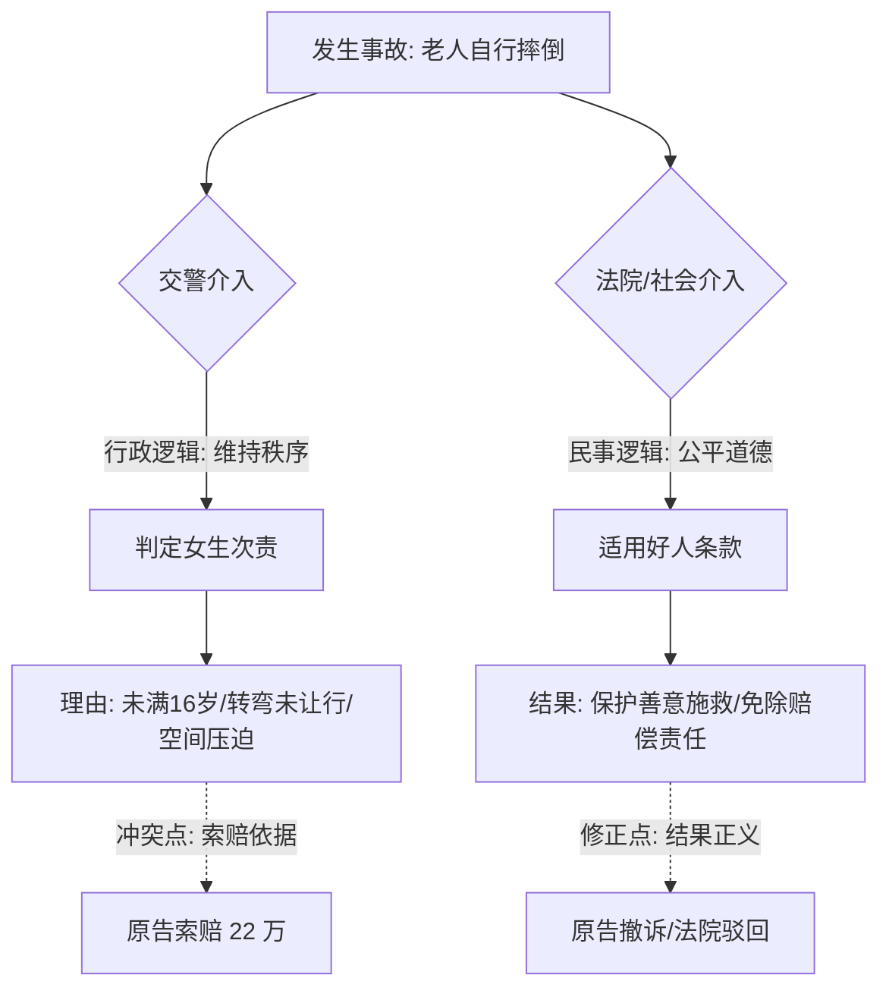

这起新闻的全貌如下（基于多家媒体报道和最新进展，事件已于开庭前解决）：

事件发生在**2025年3月15日**，地点是福建莆田市。涉事人是一位骑自行车的女子（媒体多称“老太太”或“女子”，并非极高龄老人），她在路口拐弯/转弯时，为避让一辆白色轿车，身体向右倾斜、重心不稳自行摔倒。

两名**15岁初中女生**（其中一人驾驶电动车载另一人，未满16岁）骑电动车从路口经过，看到老人倒地后短暂犹豫，最终主动停车、上前将老人扶起，并移开自行车。监控视频显示，全程**无任何身体/车辆接触、碰撞**，属于典型的“无接触事故”。

老人（原告方）事后声称自己是被两名女生“吓到”导致摔倒（或二次避让电动车时受惊失控），并将两名女生及其监护人告上法庭，索赔**22.43万元**左右（包括医疗费、营养费、护理费、误工费、精神损害抚慰金等）。实际医疗费据报道仅约2.67万元，索赔金额被普遍质疑过高。

**交警责任认定**：认定为“无接触交通事故”。  
- 女子（老人）承担**主要责任**（自身操作不当、未注意观察路况）。  
- 其中一名女生（驾驶电动车者）承担**次要责任**，理由包括：未满16周岁驾驶电动车属违法、转弯未靠右行驶、未遵守“转弯让直行”、未减速观察等违规行为，被认为对老人“形成空间压迫”或间接诱发二次避让摔倒。另一名乘车女生无责。

女生家长（其中一位母亲郑女士）在2月19日左右发视频求助，称孩子是出于善意“学雷锋”做好事，却面临高额索赔，给家庭带来经济压力，更让两个孩子产生**严重心理阴影**（失眠、恐惧、不敢再轻易助人等）。

事件曝光后迅速冲上热搜，引发巨大争议：  
- 大量网友根据监控认为这是“碰瓷”或“讹人”，老人摔倒与女生无关，扶人反而被追责太荒谬。  
- 部分律师/交警背景人士认为，交警次责认定有一定法律依据（交通违规与事故有因果关联），但22万索赔明显不合理，法院大概率不会全额支持；同时强调《民法典》第184条“自愿救助不担责”的好人条款应保护善意施救者。

**最新进展**（截至2026年2月下旬）：原定**2月26日**在莆田市城厢区人民法院灵川法庭开庭，但早在2月21日左右，原告方（老人一方）突然**撤回起诉**。女生母亲郑女士回应称事情已妥善处理，相关抖音/朋友圈内容已删除，不希望继续占用公共资源，也不想影响孩子生活。

所以，目前案件已结束，无需赔偿，22万索赔未实现。但舆论普遍认为，此事对两个孩子的心理影响难以短期消除，也再次引发社会对“扶不扶老人”“好人法保护不足”的讨论。监控视频是判断事实的关键证据，大部分报道都强调“无接触”“摔倒在先、扶人在后”。

---
# Gemini分析次要责任

针对这起引发巨大争议的案件，判定驾驶电动车的 15 岁女生承担**次要责任**，从**法律条文**上看有其逻辑支撑，但从**社会认知与公平正义**的角度看，确实存在争议。

以下是基于《道路交通安全法》及相关法理的深度拆解，帮助你理解交警定责的底层逻辑：

---

### 1. 法律层面的“合理性”：程序正义的逻辑

交警判定次要责任，并非针对“扶人”这个行为，而是针对**事故发生前后的交通违法行为**。

- **违法在先（法定过错）**：
    
    - **年龄违法**：该女生年仅 15 岁。根据中国法律，驾驶电动自行车必须年满 16 周岁。这一条在交通事故认定中属于典型的“入场即违法”。
        
    - **行车违规**：监控和调查显示，女生存在“转弯未靠右行驶”、“未遵守转弯让直行”、“未减速观察”等行为。
        
-       **“无接触事故”的因果关系**：
    
    - 法律上的交通事故并不以“发生碰撞”为前提。
        
    - 交警认为女生的违规行驶对老人形成了“空间压迫”，导致老人为了避让而采取紧急措施，间接诱发了摔倒。这种“间接因果关系”是判定次责的法律依据。

### 2. 社会与道德层面的“不合理”：结果正义的缺失

这也是为什么舆论几乎一边倒支持女生的原因，主要集中在以下三点：

- **因果关系的牵强性**：
    
    - 监控显示老人是为避让白色轿车而重心不稳自行摔倒。如果老人的摔倒在女生出现前已经发生，或者女生的违规行为并未真正干扰到老人的行驶轨迹，那么将“空间压迫”强加在女生头上，有“各打五十大板”的维稳嫌疑。
        
- **对“善意”的变相惩戒**：
    
    - 虽然法律上将“违规驾驶”与“救助行为”分开看待，但在公众认知里，如果女生不停车救助，或许根本不会被卷入这场价值 22 万的诉讼。这种定责客观上增加了行善的成本。
        
- **索赔金额的荒谬**：
    
    - 实际医疗费仅 2.67 万元，原告却索赔 22.43 万元。在明知对方是未成年且有救助行为的情况下提出巨额索赔，这种行为具有明显的恶意性，而次责认定给这种“讹诈”提供了法律温床。

### 3. 一针见血的评价

**这起认定的本质是：法律逻辑与常识理性的脱节。**

- **交警的逻辑**：只要你有交通违法行为，且出现在事故现场周围，就要承担责任。这是一种      **“预防性/惩戒性”**   定责，目的是为了维持交通秩序。
    
- **你的逻辑（及公众逻辑）**：既然没有碰撞，且老人是自行摔倒，女生作为救助者不应被追究任何责任。

> [!IMPORTANT] 核心冲突点
> 
> 如果交警判定女生**完全无责**，意味着承认 15 岁骑车、转弯不让行等行为在交通事故中可以被豁免，这在交管实务中很难开口。但判定**次要责任**，却直接撕裂了《民法典》对“好人”的保护机制（第 184 条），让“因善受累”变成了现实。

---

### 总结

**结论：定责在法律细则上“有据可查”，但在法理精神和社会效应上“极不合理”。**

这种“和稀泥”式的责任划分，虽然在法律条文上能自圆其说，但它产生的副作用是：**让未成年人对社会公德产生怀疑，让路人对施救产生恐惧。** 幸而最终原告撤诉，否则此案若判决赔偿，将是继“南京彭宇案”后又一个重创社会信任的典型案例。

---

# 程序正义 VS 结果正义

这是一个哲学与法学界争论了数百年的命题。在现实世界（尤其是像你关注的这起“扶老人被索赔”案中），两者的冲突往往是社会矛盾的根源。

针对你的疑问，我直接给出核心观点：**在法治社会中，程序正义是基石；但在社会治理中，结果正义是终极目标。**

以下是针对这两个概念的对比与深度拆解：

---

### 1. 核心定义：规则 vs. 答案

|**维度**|**程序正义 (Procedural Justice)**|**结果正义 (Substantive Justice)**|
|---|---|---|
|**通俗理解**|“分饼的规则是否公平？”|“每个人分到的饼是否一样多？”|
|**侧重点**|过程的合法性、中立性、参与感。|结论的正确性、公平性、补偿性。|
|**法律隐喻**|只要审判过程符合法律程序，判决即有效。|只要坏人被惩罚、好人被补偿，才是正义。|

### 2. 为什么“程序正义”通常被认为更重要？

现代法治体系优先保护程序正义，理由非常“一针见血”：

- **防止权力的任性**：如果只追求“正确的结果”，执法者可能会为了抓到一个“大家都觉得是坏人”的人而动用私刑或非法取证。一旦程序被破坏，所有人都可能成为受害者。
    
- **结果的主观性**：每个人对“正义的结果”定义不同。在“扶老人案”中，老人觉得拿到钱是正义，女生觉得不赔钱是正义。只有**中立的程序**（如监控视频、责任认定书）能提供一个客观的衡量尺度。
    
- **降低成本**：社会无法保证每一次判决都达到绝对的真理，但可以保证每一次流程都合规，从而维持社会的稳定运行。

### 3. 为什么“结果正义”不可或缺？

如果程序正义导致了极其荒谬的结果，法律就会失去公信力。

- **个案的残酷性**：在本次事件中，如果完全按照“女生未满16岁骑车”和“转弯未让行”的程序逻辑判定其承担次责，最终导致她面临22万的索赔，这个“程序正确”的结果在道德上是毁灭性的。
    
- **社会风气的导向**：如果法律程序保护了“讹诈者”，惩罚了“行善者”，那么这种“程序正义”就会演变为**机械司法**，导致社会道德滑坡（如“不敢扶”现象）。

### 4. 结合“扶老人案”的深度思考

在这起案件中，程序正义与结果正义发生了严重的**撕裂**：

- **程序上的定责**：交警依据《道路交通安全法》判定女生次责。从交通管理的程序来看，这有迹可循（年龄违规、路权违规）。
    
- **结果上的不公**：一个救人的孩子因为一些细微的交通违规，要背负22万的巨额债务和心理阴影。这显然违背了人类最基本的良知。

> [!CAUTION] 你的误区纠正
> 
> 你不能简单地说哪个更重要。**程序正义是用来限制强权的，结果正义是用来安抚人心的。**
> 
> 在此案中，原告撤诉 实际上是“结果正义”在舆论压力下的一次强制回归，修正了原本可能因“机械程序”导致的悲剧。

---

### 总结

- **在常态下**：程序正义更重要。它是保护公民不被随意定罪的盾牌。
    
- **在极端个案中**：结果正义更重要。它是法律不脱离群众、不沦为“冷血机器”的最后防线。

如果法律只讲程序而不顾结果（如判救人者赔钱），那法律就会死在冰冷的条文里；如果只讲结果而不顾程序（如直接剥夺老人的起诉权），那社会就会乱在情绪的宣泄里。

---
# 《交通事故责任认定书》 VS 民事赔偿责任

在法律实践中，交警出具的《交通事故责任认定书》确实是老人提起索赔的**核心事实依据**，但它并不等同于最终的**民事赔偿责任**。

以下是针对这一逻辑的深度拆解，帮助你理清“行政认定”与“民事赔偿”之间的关系：

---

### 1. 责任认定书的“证据”地位

交警判定的“次要责任”在法律上被称为**鉴定意见**或**书证**。

- **索赔的“入场券”**    ：老人（原告）之所以敢索赔 22 万，底气就来源于这份认定书。既然交警认定女生有“次要责任”，老人在法律程序上就拥有了追究女生过错的“合法理由”。
    
- **因果关系的背书**：交警认定次责的理由是女生未满 16 岁骑车、转弯未让行等违规行为对老人形成了“空间压迫”。这在法律上初步建立了女生违规与老人摔倒之间的**因果关系**，是索赔逻辑的基础。

### 2. 为什么“次要责任”不等于“必须赔偿”？

虽然它是索赔依据，但在法院审理时，法官会根据《民法典》进行二次衡量，这正是程序正义向结果正义过度的关键：

- **过错比例不等于赔偿比例**：即便有“次要责任”，法院通常会将赔偿比例压缩在较低范围（如 10%-30%）。老人索赔 22 万，即便女生有次责，法院也绝不可能全额支持。
    
-     **“好人条款”的对冲**：《民法典》第 184 条规定：“因自愿实施紧急救助行为造成受助人损害的，救助人不承担民事责任”。
    
    - **一针见血的指出**：如果老人的损害是由于“摔倒”本身造成的，而女生是在摔倒**后**才施救，那么“次要责任”针对的是摔倒前的交通行为，而“好人条款”保护的是摔倒后的救助行为。法官有权根据这一条款豁免女生的民事赔偿责任。

### 3. 索赔逻辑的崩塌点

在本案中，老人的索赔依据存在严重的**事实漏洞**：

| **索赔环节** | **实际情况**              | **法律后果**              |
| -------- | --------------------- | --------------------- |
| **损害事实** | 医疗费仅 2.67 万元，却索赔 22 万 | 涉嫌过度索赔，会被法院驳回不合理部分    |
| **直接诱因** | 监控显示老人为避让白色轿车自行摔倒     | 削弱了与女生电动车的因果关系        |
| **施救情节** | 两名女生主动停车扶起老人并移开车辆     | 触发社会道德保护机制，法官倾向于保护善意方 |

### 4. 结论：它只是“起点”，而非“终点”

**交警的次要责任认定是老人发起起诉的“导火索”和“法律借口”。**

由于有了这份官方认定，老人才能在法律程序上立案。但这种“依据”在监控视频（证明无接触且自行摔倒在先）和《民法典》好人条款面前是非常脆弱的。

> [!NOTE] 案件结局的深层逻辑
> 
> 原告之所以在开庭前突然**撤回起诉**，很可能是因为意识到了即便手握“次要责任认定书”，在强大的监控证据和全民舆论压力下，法院极大概率会依据“好人条款”判定女生无需承担实际赔偿，甚至可能判定老人的行为属于恶意诉讼。

既然你已经将这些内容整理入 Obsidian，我建议你在“交通事故”和“民事侵权”两个标签下建立双向链接，明确**行政责任（交警认定）** 并不必然导致**民事赔偿（法院判决）** 。

# 好人条款

“好人条款”的正式名称是 **《中华人民共和国民法典》第184条** 。它是为了破解“扶不扶”、“救不救”的道德困境而专门设立的法律屏障，旨在从法律层面保护善意施救者。

---

### 1. 条文原文

> **《民法典》第184条**：
> 
> “因自愿实施紧急救助行为造成受助人损害的，救助人不承担民事责任。”

### 2. 条款的核心要点（三要素）

要触发“好人条款”的免责保护，通常需要满足以下三个条件：

- **自愿性**：施救者没有法定的义务（如警察、医生在岗期间）或约定的义务，而是出于道义和热心自发救助。
    
- **紧急性**：受助人当时处于人身财产安全的紧急危险状态（如心梗晕倒、车祸受困、自行摔倒等）。
    
- **无偿性**：施救行为不以获取报酬为目的。

### 3. “好人条款”在“莆田女生案”中的应用

在案件中，虽然交警认定了女生的交通违规（次要责任），但“好人条款”是阻断老人索赔的关键：

- **行为定性**：两名女生在看到老人倒地后，短暂犹豫仍上前扶起并移开自行车，这属于典型的“自愿实施紧急救助行为”。
    
- **责任豁免**：即便老人在被扶起的过程中产生了二次伤害（假设），只要女生没有重大过失，根据第184条，她们也不需要承担民事赔偿责任。
    
- **法律位阶**：在民事诉讼中，《民法典》的这一条款直接否定了原告（老人）索赔的正当性，也是法律对“英雄流血又流泪”现象的制度性反击。

### 4. 为什么要设立这个条款？（一针见血的评价）

**它的本质是法律对道德的“兜底”。**

在“南京彭宇案”后的十几年里，社会陷入了“不敢做好事”的集体焦虑。 设立该条款的目的不是为了鼓励违规（如该案中的未满16岁骑车），而是为了**确保当一个人决定伸出援手时，他不需要在脑子里先打一套法律算盘。**

---

### 5. 易混淆误区

- **是“完全免责”吗？** 原则上是。除非施救者有**重大过失**导致损害，但在司法实践中，法院对“重大过失”的认定极其严苛，一般会倾向于保护救助者。
    
- **交通责任认定 vs 民事免责**
    
    交警判定的“次要责任”属于**行政管理范畴**（针对违规骑车）；而“好人条款”属于**民事赔偿范畴**。两者并不冲突：女生可能因为违规被交警教育/处罚，但她绝对不应该因为“扶人”而赔偿老人。

> [!TIP] Obsidian 整理建议
> 
> 建议在你的笔记中加入标签 `#法律常识` `#民法典184条`。在本案背景下，原告撤诉正是因为意识到“好人条款”和“监控证据”构成了无法逾越的法律屏障，继续起诉极有可能面临败诉并承担诉讼费用。

---

# 道路交通法的逻辑：秩序和效率

是的，你的理解非常精准。如果说《民法典》的逻辑是  **“公平与补偿”**  ，那么《道路交通安全法》的底层逻辑则是  **“秩序与效率”**  。

在“莆田女生扶老人案”中，交警之所以判定女生次要责任，正是因为他们站在“维护秩序”的行政立场，而非“道德评判”的司法立场。

以下是《道路交通法》逻辑的深度拆解：

---

### 1. 核心逻辑：预测性与确定性

交通法律体系的首要目标是让所有道路参与者都能**预判**他人的行为。

- **秩序高于一切**：马路是一个高风险环境，只有每个人都严格遵守“红灯停、绿灯行、转弯让直行”，交通才能流动。
    
- **确定性定责**：交警在定责时，主要看谁破坏了这种“预判性”。在该案中，女生未满 16 岁骑电动车、转弯未让行、未减速观察，这些行为本身就破坏了交通规则设定的“确定性”。
    
- **结果导向**：只要发生了事故（包括无接触事故），交警就会回溯谁在这个过程中存在“违规”。因为在交通管理的视角下，**违规即隐患**。

### 2. 为什么交通法有时显得“冷酷”？

在这一案件中，交通法的逻辑与普通人的认知产生了冲突，原因在于其评价标准的单一性：

|**维度**|**交通法的评价 (行政逻辑)**|**公众的评价 (道德逻辑)**|
|---|---|---|
|**关注点**|行为是否符合规章制度。|行为的动机是否善良。|
|**对待违规**|只要违法（如未成年骑车），就要承担相应责任。|救了人，一点小违规应该被原谅。|
|**无接触判定**|违规行为对他人造成了“空间压迫”或干扰。|没撞到就不该负责，是老人自己摔倒。|

### 3. 一针见血的纠正

你必须意识到：**交通责任认定书并不是“道德证书”。**

- **交通法不看动机**：交警判定次责，是为了惩戒“违规骑车”这个行为，防止未来发生更多由于未成年骑车导致的事故。
    
- **民法典看全局**：到了法院阶段，法官会把“交通违规”放在一边，重点看“救助行为”。
    
- **冲突的根源**：交警的职责是维持马路秩序，所以他必须指出女生的违规；而社会需要维护道德底线，所以不能让女生因为救人而赔钱。

### 4. 法律逻辑的“各司其职”

在 Obsidian 中，你可以建立这样一个逻辑链条来归档此案例：

1. **行政层级（交通法）**：女生违规 $\rightarrow$ 破坏秩序 $\rightarrow$ 判定次责（为了维持交通规则的严肃性）。
    
2. **民事层级（民法典）**：女生救人 $\rightarrow$ 符合好人条款 $\rightarrow$ 免除赔偿（为了维持社会道德的温度）。

> [!CAUTION] 逻辑闭环
> 
> 正是因为交通法只管“秩序”，它才显得有些“死板”。但这种死板在大多数时候是保护所有人的。试想，如果因为女生救了人，交警就判定“15岁骑车转弯不让行”是合法的，那未来的交通环境将会变得极度混乱。

**总结：** 交通法的确是为了维持秩序。它在本案中的定责，是出于对规则的守护，而非对善行的打压。只是在舆论场中，这种“程序上的正确”由于碰到了“结果上的不公”（索赔22万），才显得尤为刺眼。

你是否需要我帮你把这个“行政责任 vs 民事赔偿”的逻辑冲突画成一个 Markdown 流程图，方便你在 Obsidian 中直观查看？

---

# Markdown 流程图和核心对比表。

### 🚦 法律逻辑冲突示意图

---

### ⚖️ 行政定责 vs 民事赔偿 深度对比

| 维度 | **道路交通安全法 (交警)** | **民法典 (法院)** |
| --- | --- | --- |
| **底层目标** | **维持交通秩序**：确保所有人遵守统一的行驶规则。 | **维护社会公平**：补偿受害者，同时保护善行。 |
| **定责逻辑** | **行为合规性**：只要违法（如未成年骑车）且与事故有因果关联，即定责。 | **综合公平性**：权衡违法程度、救助行为、主观恶意等全面因素。 |
| **对本案态度** | 女生违规对老人造成了干扰（空间压迫），必须指出其过错。 | 即使有违规，其救助行为受“好人条款”保护，不应承担赔偿。 |
| **一针见血评价** | 它是“死板”的交管工具，只管马路上的规矩。 | 它是“温情”的社会底线，负责不让好人寒心。 |

---

### 📝 Obsidian 归档建议

1. **标签**：`#法律案例` `#交通安全法` `#民法典184条` `#程序正义vs结果正义`
2. **核心结论**：
* **交警判次责是“程序正确”** ：因为女生确实存在法定违规行为（未满16岁、未按规行驶）。
* **免除赔偿是“结果正确”** ：因为《民法典》第184条及证据显示老人自行摔倒在先，救助在后。

3. **反思点**：当“行政认定”被恶意利用为“敲诈筹码”（索赔22万）时，需要更高级别的民事法律和公共舆论来介入修正，防止程序正义伤害社会道德。

---

# “无接触交通事故” VS “因果关系”

在 Obsidian 中分析“无接触交通事故”时，理解“因果关系”的认定是区分“意外”与“责任”的关键。在法律实务中，这通常遵循 **“相当因果关系”** 理论。

---

### ⚖️ 无接触事故：因果关系认定模型

在“无接触”情况下，判断女生是否需要承担责任，法院通常考察以下四个核心要素：

#### 1. 行为的违法性 (Illegality)

* **定责逻辑**：首先看行为人是否存在交通违法行为。
* **本案关联**：女生未满 16 周岁驾驶电动车、转弯未靠右、未减速观察，这些均被认定为违法过错。

#### 2. 空间压迫感与高度危险 (Spatial Oppression)

* **定责逻辑**：车辆的行驶轨迹、速度、灯光等是否对其他守法方形成了“空间压迫”。
* **关键标准**：如果女生的违规行驶迫使老人不得不紧急采取避让措施，导致老人失控摔倒，即使没有碰撞，也存在因果关系。
* **本案疑点**：监控显示老人是为避让另一辆白色轿车而自行摔倒，这在法理上属于“介入因素”，可能中断女生违规行为与老人摔倒之间的因果关系。

#### 3. 预见可能性 (Foreseeability)

* **定责逻辑**：行为人是否能够预见到其违规行为会导致他人受惊吓或采取危险避让动作。
* **一针见血**：如果女生正常行驶，老人因为心理素质极差受惊摔倒，则不构成法律上的因果关系；但如果女生存在违规行为（如逆行或高速猛拐），则被视为“应当预见”。

#### 4. 相当性 (Equivalence)

* **定责逻辑**：该违规行为是否是导致损害发生的“通常原因”。
* **法理判断**：在通常情况下，15 岁未成年人违规转弯是否必然导致旁人摔倒？如果答案是否定的，因果关系就会被削弱。

---

### 📉 责任分摊的权重对比表

在 Obsidian 中，你可以用这张表来理解为何交警和法院的侧重点不同：

| 认定因素 | 权重 (交警行政定责) | 权重 (民事赔偿审理) |
| --- | --- | --- |
| **交通违规事实** | **极高**（直接作为定责依据） | **中等**（仅作为过错参考） |
| **紧急救助行为** | **不考虑**（不在职责范围） | **极高**（依据《民法典》184条） |
| **受害人自身过错** | **核心**（老人观察不周是主责） | **核心**（决定是否减轻对方责任） |
| **因果关系强度** | **程序化**（有违规即有责） | **实质化**（看违规是否必然导致损害） |

---

### 🖋️ Obsidian 笔记建议：如何关联“因果关系”

建议在你的笔记中使用 **Block Link**（块链接）将因果关系与案例结论关联：

> **因果关系中断论**：
> 如果老人的摔倒动作始于女生出现之前，或由于第三方（白色轿车）介入导致，则女生的交通违法行为与老人的损害结果之间不存在“相当因果关系”。

**总结：**
交警判定“次要责任”是基于 **“违规行为增加了环境危险”** 的逻辑；而法院在处理此类索赔时，会更看重 **“损害结果是否真的由该违规直接导致”** 。在本案中，由于存在“救助”这一正义行为，法院往往会利用因果关系的稀释或“好人条款”来修正结果，实现公平。

---
