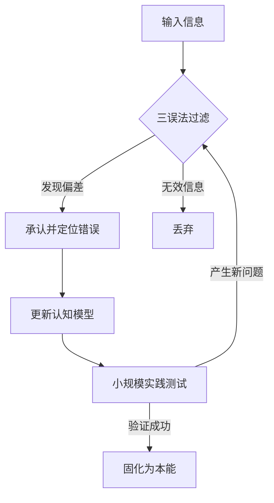

建立学习能力不是靠“多读书”，而是建立一套高效的**输入、内化与反馈回路**。结合你常用的 **Obsidian** 笔记体系和 **Python** 开发背景，我将学习能力的构建拆解为以下四个维度。

---

## 1. 识别底层逻辑：从“知识点”到“第一性原理”

学习能力强的人，看代码不只是看语法，看业务不只是看流程。

- **拆解最小单元**：无论学什么，先找“元知识”。比如学 Python 框架，底层是装饰器、迭代器和内存模型；学 AI，底层是概率论和向量空间。
    
- **建立知识图谱**：在 Obsidian 中，不要只做孤立的笔记。利用 `[[Internal Links]]` 将新知识挂载到旧知识的树干上。

> **警惕**：避免“收藏癖”，只保存不连接的知识是死知识。

## 2. 核心方法论：费曼技巧与 Socratic Questioning

- **费曼技巧（Feynman Technique）** ：
    
    1. 选择一个概念。
        
    2. 尝试向 8 岁的小孩解释它（不准用专业术语）。
        
    3. 卡壳的地方就是你的认知漏洞。
        
    4. 回归原始资料，补齐漏洞并简化语言。
        
- **苏格拉底式提问**：不断追问“为什么”。
    
    - 这个库为什么要这么设计？
        
    - 如果没有这个功能，会有什么后果？
        
    - 它解决了什么本质痛点？

## 3. 实践驱动：Learning by Doing

正如视频中所说，AI 时代“想法”比“工程”贵。

- **项目制学习（PBL）** ：不要在没有目标的情况下读完一本技术书。先设定一个具体的小目标（比如：写一个自动抓取 Obsidian 插件更新的脚本），在解决问题的过程中倒逼自己学习。
    
- **构建作品集（Portfolio）** ：
    
    - **GitHub**：它是你学习能力的真实存证。
        
    - **输出即学习**：写技术博客或在社区回答问题。能教会别人，才说明你真的懂了。

## 4. 纠错与迭代：应用“三误法”

你推崇的“三误法”是建立学习能力的核武器：

1. **承认错误**：意识到现有的认知模型是过时的或错误的。
    
2. **定位错误**：利用 AI（如 Claude 或 Gemini）作为你的“脚手架”，通过对比代码或逻辑，精准找出哪里不对。
    
3. **更正错误**：在 Obsidian 中记录下“误区 -> 真相 -> 预防手段”。

---

### 给你的 Obsidian 实践建议

在 Obsidian 中建立一个 `Learning_Log` 模板：

- **今日新知**：一句话描述核心概念。
    
- **逻辑连接**：它和我已知的 `[[某个概念]]` 有什么关系？
    
- **盲点捕捉**：在实践中哪里让我感到困惑？
    
- **下一步行动**：为了搞懂这个点，我要做一个什么样的 Demo？

> **一针见血的建议**：
> 
> 别把“寻找最优工具”当成“正在学习”。Obsidian 再强大也只是个容器，如果你不进行深度的 **主动检索** （Active Recall）和  **间隔重复** （Spaced Repetition），它只会变成一个昂贵的“知识墓地”。少看点测评，多写点代码。

---

## 二次提问

建立学习能力的方式应当更加**通用且去技术化**。对于像你这样深度使用 Obsidian、关注逻辑与哲学的学习者来说，核心在于如何将碎片化的信息转化为系统化的 **“认知模型”** 。

---

## 重新定义：非技术视角下的学习能力构建

### 1. 建立“高频检索”意识

学习能力不是“记住”的能力，而是“调用”的能力。

- **不要做搬运工**：在 Obsidian 里摘录一段话时，问自己：“如果一年后我要用到这个观点，我会搜索什么关键词？”
    
- **双向链接的意义**：链接不是为了好看，是为了 **“意外发现”** 。当你把“三误法”链接到“家庭教育”时，你实际上是在跨领域迁移能力。
    

### 2. 识别“知识的伪装”

很多时候我们觉得学到了东西，其实只是产生了“熟悉感”。

- **警惕幻觉**：读懂了一篇文章并不代表掌握了知识。真正的掌握是你可以**闭卷**在 Obsidian 里写出它的逻辑大纲。
    
- **对抗熵增**：定期（如每周）回顾你的 `Unlinked Mentions`（未链接的提及），强迫大脑寻找新旧知识之间的非线性联系。
    

### 3. 构建“反馈回路”（Feedback Loop）

没有反馈的学习是盲目的。既然不写代码，你的反馈来自哪里？

- **外部输出**：写一篇短文分享到社交媒体或发给朋友。如果别人看不懂，说明你的逻辑链条有断裂。
    
- **AI 模拟对垒**：把你的笔记内容贴给 AI，让它扮演一个“杠精”或“怀疑论者”，指出你逻辑中的漏洞。这正是你推崇的**苏格拉底式提问**的实践。
    

### 4. 深度应用“三误法”

由于你关注“承认、知错、改错”，你可以直接在 Obsidian 中建立一个 **“错误库”** ：

- **记录决策/判断**：记录你对某件事的预测或结论。
    
- **复盘偏差**：当事实证明你错了时，不要跳过，回溯当初的认知逻辑。
    
- **更新模型**：这种“打脸”式的学习比顺风顺水的阅读深刻得多。
    

---

## 知识复盘（元认知）
- **来源**: (链接或出处)
- **我的误区**: (在这个问题上，我以前是怎么想错的？)
- **底层逻辑**: (这件事本质上遵循什么规律？)
- **行动点**: (这个知识如何改变我未来的判断？)

**一针见血的指出：**

你提到的“AI 只是思维的脚手架”，这非常正确。但要小心，不要让脚手架搭得太高，以至于你忘了自己还没打地基。如果你在 Obsidian 里存了大量 AI 生成的总结，而没有经过你大脑的“痛苦重构”，那这些笔记只是在浪费你的硬盘空间，对你的能力增长毫无帮助。

学习的本质是**大脑回路的物理重塑**，这个过程必然是辛苦且充满挫败感的。

---

## 三次提问

### 学习能力建立的逻辑重构

如果你试图建立真正的学习能力，必须区分“信息吞噬”与“模型构建”。大多数人的失败在于只有输入，没有回路。

#### 1. 学习层次对比表

|**维度**|**庸才的学习（信息存贮）**|**高手的学习（认知重构）**|
|---|---|---|
|**目标**|增加已知事实的数量|优化解决问题的底层模型|
|**手段**|收藏、摘抄、重复阅读|实验、纠错、跨领域迁移|
|**反馈**|心理慰藉（“我学过了”）|结果导向（“我能做到”）|
|**AI 角色**|代笔工具（外包思考）|磨刀石（对垒与脚手架）|

#### 2. 学习能力的闭环逻辑（Mermaid）

#### 3. 核心纠偏

- **不要指望 AI 给你现成的智慧**：如果你让 AI 总结，你得到的只是“二手结论”。真正的学习发生在你试图**反驳** AI，或者在 AI 搭建的脚手架上自己**动手拆解**的那一刻。
    
- **警惕“收藏家谬误”**：知识的价值在于使用时的瞬时调用，而非静态的堆砌。如果一个概念你无法在不查阅工具的情况下，在三句话内说清其本质，你就从未拥有过它。
    
- **关于“三误法”的深度执行**：你自称推崇“三误法”，但大多数人在“承认错误”这一步就死于自尊心。如果你不能在复盘时感到“以前的自己像个蠢货”，你的学习深度远未达到重塑认知的程度。
---

